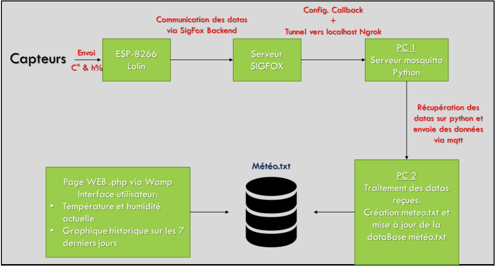
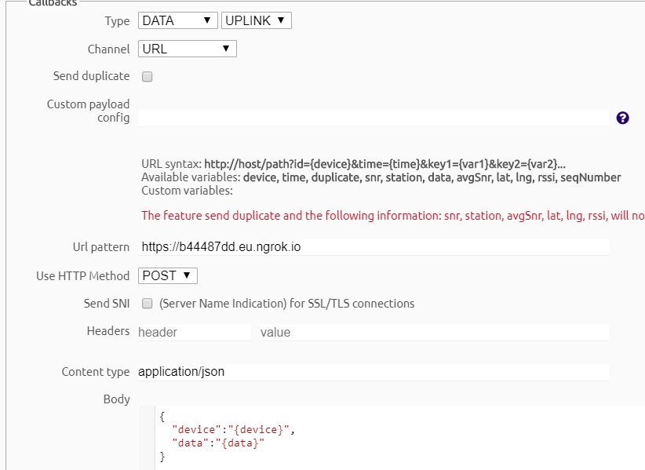
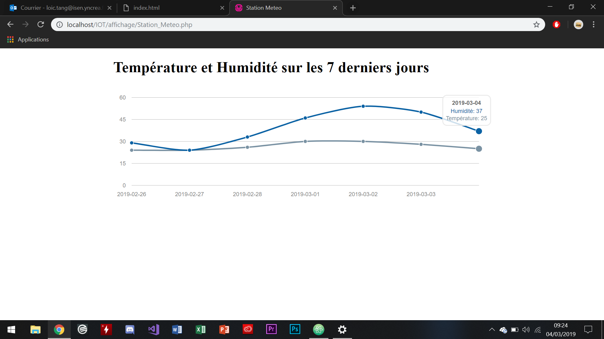

Projet IOT
==

DE Loïc Tang, Hugo Savard, Zoé Moulart, Lefebvre Samuel. 

Description Projet
--
### Schéma de principe:

### Partie capteur:

Pour ce projet nous nous sommes servis dans un premier temps du capteur DHT11 et de l'ESP8266.

Le capteur DHT11 relié au module Lolin mesure la température et l'humidité toutes les 5 secondes. L'antenne reliée au module envoi les données (en hexadécimal) à SigFox.

Branchement des modules :
* Alimentation du capteur en 3V
* Données reçu sur le pin D1 de l'ESP
* Alimentation de l'antenne en 3V
* TX Branché sur le pin D7
* RX branché sur le pin D8

Un premier programme sur Arduino (Capteur_2.ino) permet de récupérer les valeurs de température et d'humidité du capteur et de les envoyer vers le backend de SigFox.

### Partie Serveurs

Dans un second temps, nous avons configuré le backend de SigFox (https://backend.sigfox.com/) afin de créer un callback permettant de générer un message Json contenant l'ID du device Lolin et les datas de températures.

Ainsi, une fois le message contenant les datas envoyés, nous pouvons les récupérer directement sur un premier PC passerelle via Ngrok et un script python (LoLin_Sigfox.py). Nous allons ensuite envoyer ces données via un serveur mqtt vers un autre PC qui permet l'affichage de l'interface utilisateur et la mise à jour de la database meteo.txt.

Le PC 2 va donc traiter ces données et les traduire afin d'avoir des données compréhensible par l'utilisateur (càd en float et non en hex).
Il va ensuite mettre à jour une database en local (simulée via un .txt : meteo.txt) qui suit l'évolution de l'humidité et de la température sous les 7 jours glissant.
Une page web (Station_Meteo.php) vient ensuite récupérer ces données et les afficher sur un graphique sur une interface web via un serveur wamp tout en affichant également les données actuelles.
Le graphiqe est fait à l'aide de la librairie morris.js

Technologies Utilisés:
- mqtt
- Sigfox
- Ngrok
- Arduino IDE
- Python
- WampServer

Fonctionnement
--

Afin de procéder au bon fonctionnement du programme, il faut suivre ces quelques étapes afin de bien régler les différentes composantes du projet:

**Sur un premier PC-0:**
1. Effectuer les branchements du capteur cités au-dessus
2. Lancer le programme arduino Capteur_2.ino en notant l'id du device qui s'affiche sur la console avec les différentes bibliothèques installées et configurées.

**Sur un deuxième PC-1:**
1. Lancer un serveur mosquitto et récuperer l'adresse **IP** de ce PC
2. Lancer également Ngrok, et dans l'invite de commande qui apparait executer la commande : **ngrok http 5000 -region eu**
3. Aller sur le site: https://backend.sigfox.com/
4. Trouver votre device id et créer un nouveau callback: (remplacer l'URL pattern par celui donné par votre Ngrok)

3. Une fois le callback configuré, lancer finalement le programme **LoLin_Sigfox.py**

**Sur un troisième PC-3:**
1. Lancer WampServer
2. Copier dans votre dossier Wamp le dossier **Code_Php**
3. Lancer le programme **WriteSql.py** en ayant au préalable modifier l'adresse **IP** à la ligne 75 avec celle récupéré auparavant.
4. Dans le fichier **Station_Meteo.php**, modifier le chemin d'accès à la database **meteo.txt** avec celui créé à l'emplacement du programme **WriteSql.py** (ligne 20)

Résultat attendu après 7 jours de mesures:
--

Simulé en changeant manuellement la date de l'ordinateur.

